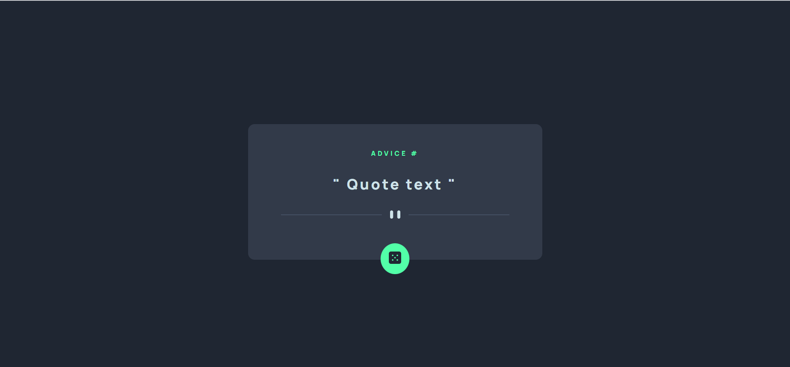
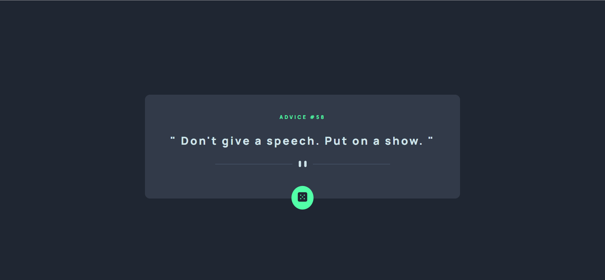
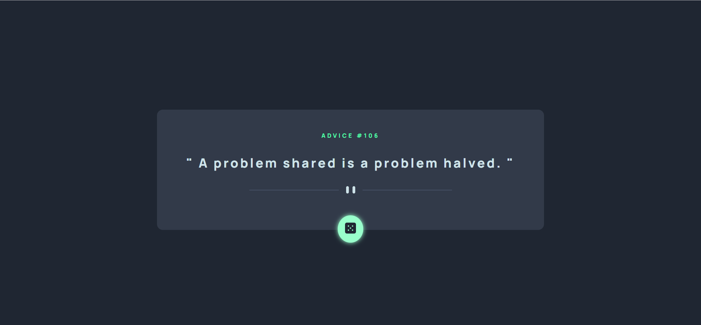
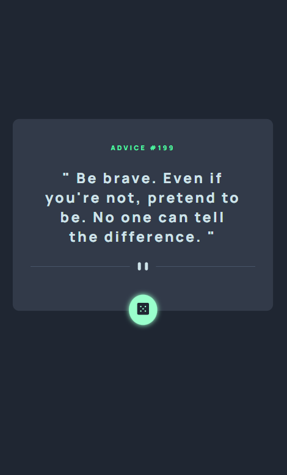

# Frontend Mentor - Advice generator app solution

This is a solution to the [Advice generator app challenge on Frontend Mentor](https://www.frontendmentor.io/challenges/advice-generator-app-QdUG-13db). Frontend Mentor challenges help you improve your coding skills by building realistic projects.

## Overview

### The challenge

When a button is pressed, the application's straightforward web page shows a random bit of advice. The HTML code specifies the elements that make up the page's structure, including a container element for the advice content, a heading element for the advice number, a paragraph element for the advise itself, and a button element for displaying a new random advice. & The background color, font, margins, padding, and positioning are all styles that are determined by CSS code. When a button is clicked, the JS code retrieves the advise data from an API, extracts the ID and text of the advice, and updates the associated HTML elements with the newly acquired data.

### Screenshot

This image shows the design of the advise card which has advise number, advise text and a button to generate a random advise on each click.

In this image, we can see that an advise is generated and the layout is for the desktop view.

Here we can see that the button's color is changed(increased brightness) and a box shadow is added additionally when the cursor is hovered over it.

This is the mobile view of the advise generator application.

### Links

- Solution URL: [Add solution URL here](https://your-solution-url.com)
- Live Site URL: [Add live site URL here](https://your-live-site-url.com)

## My process

### Built with

- Semantic HTML5 markup
- CSS custom properties
- Flexbox
- CSS Grid
- Javascript
- API

The advice generator application's HTML code has a main element that encloses a div element with a class of container and the advice generator application itself. The advice number is displayed in a h1 element with the class of advice inside the container div, and a span element with the id advice-id will dynamically be populated with the advise number from the API. The real advise is displayed below the h1 element in a p element with the class of advice-text, and the advice text from the API is dynamically loaded into a span element with the id of advice-text. An img element with the class of divider follows the p element and shows a decorative divider. An image element with the class of dice-btn is contained inside a button element with the id of btn that is located at the end of the container. Lastly, the script file script.js is added to the application to increase functionality.

This application's layout is styled using the CSS code. A typeface from Google Fonts is first imported. The box model for all HTML components is then established, along with the primary and secondary root variables, and the dark blue background color for the body. The primary content area of the page is styled using the container class. It uses flexbox to center it on the page, has a dark grayish-blue background, and a margin-top of 15 rem to move it down the page. Additionally, it is padded, has a border-radius, and is positioned reasonably. Text inside the container is styled using the advice and advice-text classes. The writing offering guidance is neon-green, smaller, and has letter spacing. The advice-text class contains bold, letter-spacing, a higher font size, and a light cyan hue. The button class is used to style a button with a border-radius of 50%, padding, and a neon-green background color. Absolute positioning at the bottom of the container, with a hover effect that changes the background color and adds a box-shadow. Last but not least, a media query is used to center the container on the page and make it 90% wide on displays with a maximum width of 600px by setting the left and right margins to auto.

AdviceId, AdviceText, and btn are the three variables that the JavaScript code defines. The HTML elements with the IDs advice-id and advice-text can be accessed using the document by using adviceId and adviceText, respectively.the method selector(). The HTML button element with the ID btn is accessed with the keyword btn. The getAdvice() function is defined, which sends a GET request to the https://api.adviceslip.com/advice URL using the Fetch API. ending of an API. The advisory ID and text are then extracted from the JSON data when the response is retrieved in JSON format. The extracted advice data is then updated into the textContent and innerHTML attributes of the adviceId and adviceText elements, respectively. The btn element receives an event listener that watches for a click event and executes the getAdvice() method when it detects one. This will trigger the fetch() request and update the advice displayed on the webpage with the newly retrieved advice data.

### What I learned

I have gained knowledge about utilizing HTML, CSS, and JavaScript to develop a simple web application by building this one. Additionally, I now know how to use an API to retrieve data and display it on a website. Furthermore, I now know how to layout your application with CSS and make it flexible to various screen widths. As I had to consider how to organize my code and design my application to fulfill the necessary functionality and user experience, building this application may have also helped me enhance my problem-solving abilities.

### Continued development

Here are some suggestions for further development of the advice generator app:

Save favorite advice: Add a feature that allows users to save their favorite advice in a list or collection so that they can easily access them later.

Share advice on social media: Add social media sharing buttons that allow users to share advice on social media platforms like Twitter, Facebook, Instagram, and more.

Categorize advice: Add tags or categories to each advice to make it easy for users to find related advice.

Personalization: Add the ability for users to enter their name or other personal information and receive customized advice based on their input.

Localization: Translate advice into different languages so that users from all over the world can benefit from the app.

User ratings: Allow users to rate each advice and provide feedback on its usefulness or relevance. This could help improve the quality of advice provided and make the app more engaging.

Integration with other apps: Integrate the advice generator app with other popular apps such as productivity or mindfulness apps, to provide users with advice that is relevant to their context.

Voice-activated commands: Incorporate voice-activated commands, so that users can ask for advice without the need to touch any buttons or type anything.

These are just a few examples of ways to improve and enhance the advice generator app. There are many other features that could be added to make the app even more engaging and useful to users.

## Author

- Frontend Mentor - [@HarshaVardhanNandamuri](https://www.frontendmentor.io/profile/HarshaVardhanNandamuri)
- Linkedin - [@Bhanu Harsha Nandamuri](https://www.linkedin.com/in/bhanu-harsha-nandamuri-b31a80149/)

